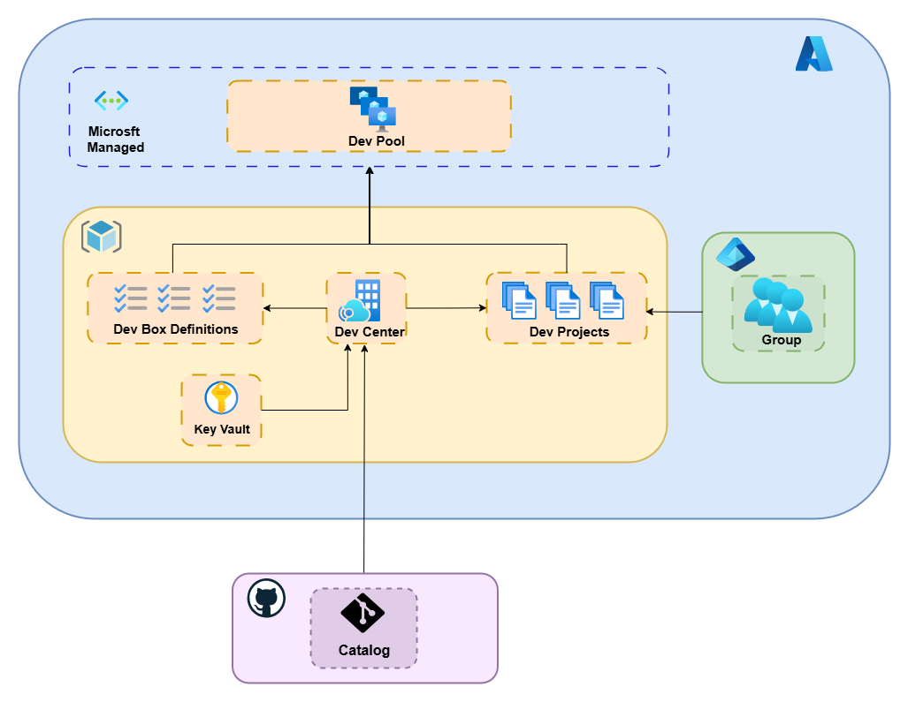
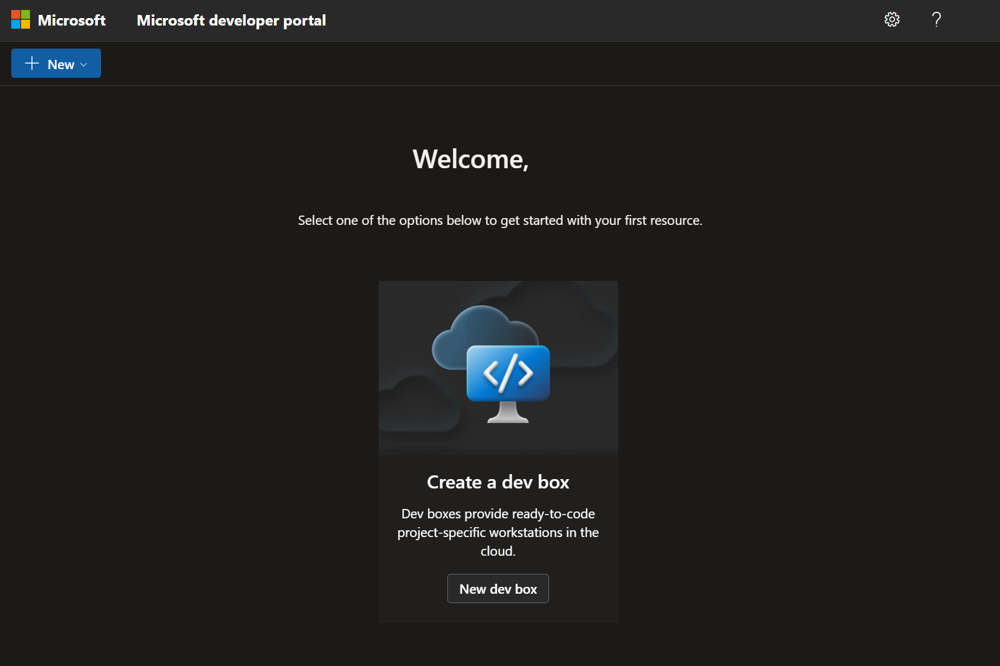

# Microsoft Dev Box Demo 

## Table of Contents

- [Purpose](#purpose)
- [Infrastructure Overview](#infrastructure-overview)
- [What You'll Build](#what-youll-build)
- [Expected Costs](#expected-costs)
- [Prerequisites](#prerequisites)
- [Getting Started](#getting-started)
  - [Setting up Codespaces (Recommended)](#setting-up-codespaces-recommended)
  - [Initial Configuration](#initial-configuration-and-deployment)
- [Usage](#usage)
- [Next Steps](#next-steps)
- [Cleanup](#cleanup)

---

## Purpose

This repository demonstrates the capabilities of **Microsoft Dev Box** and showcases how to provision and manage cloud-based development environments using **Terraform**. 

This demo environment creates a fully functional Microsoft Dev Box infrastructure that allows developers to spin up cloud developer workstations. 

---

## Infrastructure Overview

This Terraform configuration deploys the following Azure resources:

- **Azure Dev Center**: Central management hub for developer infrastructure
- **Dev Center Project**: Project workspace for development teams
- **Dev Pool**: Pool of cloud workstations for developers
- **Dev Box Definition**: Configuration for individual dev boxes e.g. CPU, memory, storage, image
- **Azure Key Vault**: Secure storage for GitHub PAT and other secrets
- **Azure AD Security Group**: Team access management
- **Role Assignments**: Proper permissions for dev center operations
- **Managed Virtual Network**: Connection to an Azure-managed network infrastructure to host dev boxes


This infrastructure provides a developer with the ability to create cloud workstations, based off a defined image and a defined combination of CPU size, memory and storage.

In addition, you can run automated customization tasks after dev box creation. These tasks can install additional software, configure IDE extensions, clone GitHub repositories, and set up your development environment. Tasks are defined as YAML files stored in a GitHub repository catalog.

---

## What You'll Build

By the end of this demo, you'll have:

- A fully configured Azure Dev Center
- A development project with catalog integration
- A security group for team access control
- A GitHub-connected catalog for config-as-code tasks
- A dev pool with a defined dev box template, connected to a Microsoft managed network

This demo will be using pre-determined values for the dev box setup, including: 

- Location: UK South Azure region
- Image: Visual Studio 2022 Enterprise on Windows 11
- Specs: 8 vCPU, 32GB RAM and 256GB Storage for the Dev Box



*Figure: High-level architecture of the Microsoft Dev Box demo, showing the relationships between Dev Center, Project, Box Definition, Dev Pool in the Microsoft-managed network, Key Vault, Security Group, and Catalog integration.*

[🔗 View the diagram full-size](./assets/devbox-diagram.png)


## Expected Costs

The underlying resources used for this demo will incur minimal Azure costs. Most components are in free tiers, but Key Vault operations may have small charges.

**However, any Dev Boxes that you choose to manually spin up will incur a cost. It is important to shut down these dev boxes when not in use to reduce costs. Auto shut-down capability has been included by default in this demo**

You can view how much a Dev Box costs per hour here: [Dev Box Pricing](https://azure.microsoft.com/en-us/pricing/details/dev-box)

---

## Prerequisites

### Required Azure Permissions
- **Azure Subscription**: Owner or Contributor role
- **Microsoft Entra ID**: Groups Administrator role or higher

### Licensing
- **License**: For each prospective user of Dev Box, the following license is needed:
   - Windows 10 Enterprise or Windows 11 Enterprise
   - Microsoft Intune
   - Microsoft Entra ID P1

   **Note:** If you (and any prospective user of Dev Box) have one of the following licenses, this prerequisite is covered:
   - Microsoft 365 F3
   - Microsoft 365 E3
   - Microsoft 365 E5
   - Microsoft 365 A3
   - Microsoft 365 A5
   - Microsoft 365 Business Premium
   - Microsoft 365 Education Student Use Benefit


### External Requirements
- GitHub repository with catalog
- GitHub Personal Access Token (PAT) with read-access to catalog

   If you do not already have a catalog or GitHub PAT:

   - Fork this [Microsoft quickstart repo](https://github.com/microsoft/devcenter-catalog.git)

   - Create a GitHub PAT by following the [Microsoft documentation on configuring catalogs](https://learn.microsoft.com/en-gb/azure/deployment-environments/how-to-configure-catalog?tabs=GitHubRepoPAT#create-a-personal-access-token-in-github)
   - Make sure to copy it down so you don't lose it
  

---

## Getting Started

### Setting up Codespaces (Recommended)

GitHub Codespaces provides the easiest way to work with this repository as it comes pre-configured with all necessary tools.

1. **Create a new Codespace:**
   - Navigate to the repository on GitHub
   - Click the green "Code" button
   - Select the "Codespaces" tab
   - Click "Create codespace on main"

2. **Wait for the environment to initialize** - The codespace will automatically install all required dependencies including:
   - Terraform CLI
   - Azure CLI
   - Git
   - All necessary extensions


### Initial Configuration and Deployment

Once your Codespace is running, complete these setup steps:

#### 1. Azure Authentication
Authenticate with Azure using the Azure CLI:

```bash
# Bash
az login
```

Follow the prompts to complete the authentication process. Ensure you're connected to the correct subscription:

```bash
# Bash
az account show
```

If you need to switch subscriptions:
```bash
# Bash
az account set --subscription "Your Subscription Name or ID"
```


#### 2. Resource Provider Set Up

The following Azure resource providers must be registered in your subscription:
   - `Microsoft.DevCenter` - For Azure Dev Center resources
   - `Microsoft.Network` - For managed network infrastructure
   - `Microsoft.KeyVault` - For Key Vault secrets management
   - `Microsoft.Authorization` - For role assignments
   - `Microsoft.Resources` - For resource group management

   You can register these providers using the Azure CLI:
   ```bash
   az provider register --namespace Microsoft.DevCenter
   az provider register --namespace Microsoft.Network
   az provider register --namespace Microsoft.KeyVault
   az provider register --namespace Microsoft.Authorization
   az provider register --namespace Microsoft.Resources
   ```


#### 3. Environment Configuration
Copy the example environment file and configure your variables:

```bash
# Bash
cp .env.example .env
```

Edit the `.env` file with your specific values:

```bash
# Your .env file should contain:
ARM_SUBSCRIPTION_ID=your_azure_subscription_id
GITHUB_PAT=your_github_personal_access_token
GITHUB_URI=https://github.com/your-handle/repo-name.git
GITHUB_PATH=your_github_path
```

**Note**: if you're using the [Microsoft quickstart repo](https://github.com/microsoft/devcenter-catalog.git), then you would use the following values (make sure to change your handle).
```bash
# Bash
GITHUB_URI=https://github.com/<your-github-handle>/devcenter-catalog.git
GITHUB_PATH=Tasks
```

**Note**: the dev box image and SKU values have been specified for you. Once you're familiar with the demo, you can customise these values.
```bash
# Bash
DEV_BOX_IMAGE=microsoftvisualstudio_visualstudioplustools_vs-2022-ent-general-win11-m365-gen2
DEV_BOX_SKU=general_i_8c32gb256ssd_v2
```


#### 4. User Configuration [OPTIONAL] 

This demo uses a security group for authorisation to Dev Box.

This approach aligns with Azure Dev Projects best practices, enabling precise control over which development teams can access specific projects and catalogs for provisioning cloud workstations

If you would like to add more users aside from yourself, such as a specific developer team, you can do so by populating a `users.yaml` file. 

Copy the example into a new `users.yaml` file with the command below

```bash
# Bash
cp users.yaml.example users.yaml
```

On line 28 of `users.yaml`, replace the line of code with the following:

```yaml
users:
    # user 1
    - object_id: "user-object-id"
    name: "User Name"
    email: "user@example.com"
    # user 2
    - object_id: "user-object-id"
    name: "User Name"
    email: "user@example.com"
```

Replace the `object_id` value with the object IDs of your users. Add as many users as you need to for the demo. 


#### 5. Deployment

To deploy the resources to your Azure environment, run the following script:

```bash
source ./deploy.sh
```

This will check the terraform configuration and proceed to spin up the demo resources in a brand new azure resource group. 

**Note:** The provisioning time may take a few minutes to complete. Wait until you see the following message in the terminal:

```bash
Terraform apply succeeded.
```

---
## Usage

1. **Check Azure Portal:**
   - Navigate to your resource group
   - Verify that you can see the following in the resource group:
      - Dev Center
      - Dev Project
      - Dev Box Definition
      - Dev Pool
      - Key Vault
   - Verify that your catalog has successfully synced with Dev Center

2. **Test Dev Portal Access:**
   - Go to https://devportal.microsoft.com
   - Sign in with your Azure account
   - You should see your project listed

3. **Verify Catalog Connection:**
   - In the Dev Portal, try creating a new dev box



*Figure: Screenshot of the dev portal when a signed-in user has been given the correct permissions to use the service via Azure RBAC*


---

## Next Steps

### Attaching a Private Catalog

As mentioned in the optional pre-requisites, if you would like to attach your own private repository of tasks and you didn't do so already, you will need to create a GitHub Personal Access Token. 

For detailed instructions on how to set this up, refer to the [Microsoft documentation on configuring catalogs](https://learn.microsoft.com/en-gb/azure/deployment-environments/how-to-configure-catalog?tabs=GitHubRepoPAT#create-a-personal-access-token-in-github).

---

## Cleanup

To remove all created resources and avoid ongoing costs:

```bash
# Bash
source ./destroy.sh
```

**⚠️ Warning**: This will permanently delete all resources created by this Terraform configuration.

---

**Note**: This is a demonstration repository. For production deployments, consider implementing additional security measures, monitoring, and governance policies according to your organization's requirements.
